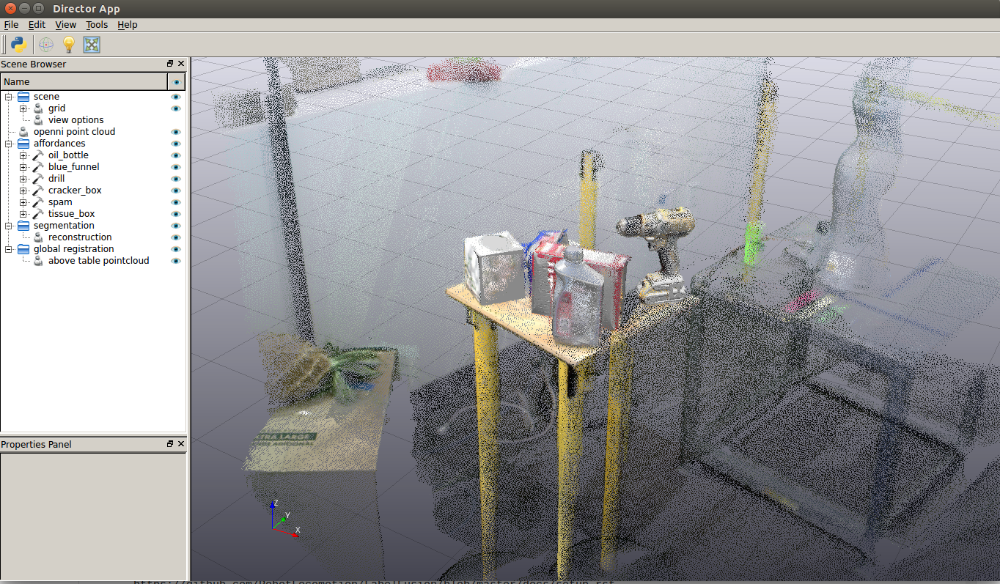
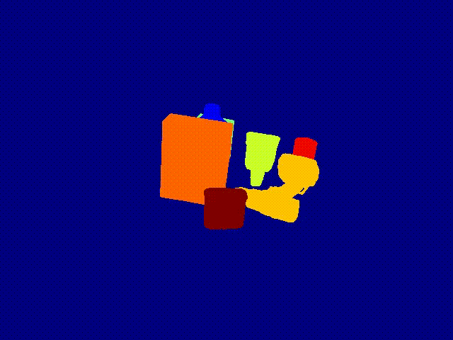

LabelFusion
===========

.. image:: docs/fusion_short.gif

This repo holds the code for LabelFusion.

- paper: https://ieeexplore.ieee.org/abstract/document/8460950
- arxiv preprint: https://arxiv.org/abs/1707.04796
- video: https://www.youtube.com/watch?v=nc65CF1W9B0

====
Quick Links
====

- Are you looking to get started making your own data?  **first go get our docker image:** https://hub.docker.com/r/robotlocomotion/labelfusion/
- Are you looking to download the example dataset? **you can find links here to either download a 5 GB subset, or all ~500 GB of data** http://labelfusion.csail.mit.edu/#data
- Are you trying to understand the organization of the data? **this documents the organization of the data**: https://github.com/RobotLocomotion/LabelFusion/blob/master/docs/data_organization.rst

=====
Getting Started
=====

First step is to download and set up our Docker_.

.. _Docker: https://hub.docker.com/r/robotlocomotion/labelfusion/

If alternatively you'd like to natively install, this document may be helpful: https://github.com/RobotLocomotion/LabelFusion/blob/master/docs/setup.rst

===========================
Inspecting Data from LabelFusion
===========================

If you've downloaded some of LabelFusion data and would like to inspect some of it, we recommend the following:

1. Run our docker image (instructions here: https://hub.docker.com/r/robotlocomotion/labelfusion/)
2. Inside the docker image navigate to a log directory and run the alignment tool. Even though the data has already been labeled, you can inspect the results:

::

	cd ~/labelfusion/data/logs_test/2017-06-16-20
	run_alignment_tool

You should see a GUI like the following:

4. Inspect labeled images (:code:`cd path-to-labelfusion-data/logs_test/2017-06-16-20/images` and browse the images)
5. Run a script to print out the overall status of the dataset (note this may take ~10-20 seconds to run for the full dataset): :code:`dataset_update_status -o`

Training on Object Detection, Segmentation, and/or Pose data
----------------------------

.. image:: docs/bbox_trim.gif

LabelFusion provides training data which is able to train a variety of perception systems.  This includes:

- semantic segmentation (pixelwise classification)
- 2D object detection (bounding box + classification) -- note that we provide the segmentation masks, not the bounding boxes, but the bounding boxes could be computed from the masks
- 6 DoF object poses
- 3D object detection (bounding box + classidication) -- the 3D bounding box can be computed from the 6 DoF object poses together with their mesh.
- 6 DoF camera pose - this is provided without any labeling, just through the use of the dense SLAM method we use, ElasticFusion

Please see this document to better understand how the data is structured: https://github.com/RobotLocomotion/LabelFusion/blob/master/docs/data_organization.rst

At the time of publication for LabelFusion, we used this repo to train segmentation networks: https://github.com/DrSleep/tensorflow-deeplab-resnet

===========================
Quick Pipeline Instructions for Making New Labeled Data with LabelFusion
===========================

This is the quick version.  If you'd prefer to go step-by-step manually, see Pipeline_Instructions_.

.. _Pipeline_Instructions: https://github.com/RobotLocomotion/LabelFusion/blob/master/docs/pipeline.rst

Collect raw data from Xtion
---------------------------

First, :code:`cdlf && cd data/logs`, then make a new directory for your data.  In one terminal, run:

::

	openni2-camera-lcm

In another, run:

::

	lcm-logger

Your data will be saved in current directory as :code:`lcmlog-*`.

Process into labeled training data
----------------------------------

First we will launch a log player with a slider, and a viewer.  The terminal will prompt for a start and end time to trim the log, then save the outputs:

::

	run_trim

Next, we prepare for object pose fitting, by running ElasticFusion and formatting the output:

::

	run_prep

Next, launch the object alignment tool and follow the three steps:

::

	run_alignment_tool

1. 	Check available object types:

    - In your data directory, open ``object_data.yaml`` and review the available objects, and add the objects / meshes that you need.

      - If you need multiple instances of the same object, you will need to create separate copies of the object with unique names (e.g. ``drill-1``, ``drill-2``, ...). For networks that do object detection, ensure that you remove this distinction from your labels / classes.

2. 	Align the reconstructed point cloud:

	- Open measurement panel (View -> Measurement Panel), then check Enabled in measurement panel
	- Use ``shift + click`` and click two points: first on the surface of the table, then on a point above the table
	- Open Director terminal with F8 and run::

		gr.rotateReconstructionToStandardOrientation()

	- Close the ``run_alignment_tool`` application (ctrl + c) and rerun.

3. 	Segment the pointcloud above the table

	- Same as above, use ``shift + click`` and click two points: first on the
	surface of the table, then on a point above the table
	- Open Director terminal with F8 and run::

		gr.segmentTable()
		gr.saveAboveTablePolyData()

	- Close the ``run_alignment_tool`` application (ctrl + c) and rerun.

4. 	Align each object and crop point clouds.

	- Assign the current object you're aligning, e.g.::
	
		objectName = "drill"

	- Launch point cloud alignment::

	    gr.launchObjectAlignment(objectName)

	  This launches a new window. Click the same three points in model and on pointcloud. Using ``shift + click`` to do this. After you do this the affordance should appear in main window using the transform that was just computed.

	  -	If the results are inaccurate, you can rerun the above command, or you  can double-click on each affordance and move it with an interactive marker: ``left-click`` to translate along an axis, ``right-click`` to rotate along an axis.

	- When you are done with an object's registration (or just wish to save intermediate poses), run::

		gr.saveRegistrationResults()

After the alignment outputs have been saved, we can create the labeled data:

::

	run_create_data
	
By default, only RGB images and labels will be saved.  If you'd also like to save depth images, use the :code:`-d` flag:

::

	run_create_data -d

==================
Citing LabelFusion
==================

If you find LabelFusion useful in your work, please consider citing:

::

	@inproceedings{marion2018label,
	  title={Label Fusion: A Pipeline for Generating Ground Truth Labels for Real RGBD Data of Cluttered Scenes},
	  author={Marion, Pat and Florence, Peter R and Manuelli, Lucas and Tedrake, Russ},
	  booktitle={2018 IEEE International Conference on Robotics and Automation (ICRA)},
	  pages={3325--3242},
	  year={2018},
	  organization={IEEE}
	}
